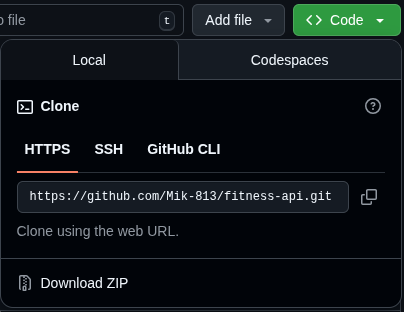

# Fitness API
A laravel based API for "Fitness routine manager" project
#### **[▶️ Open / ⬇️ Download](links)**

## Tutorial
### Feature two
Short description and a pitcture


### Feature three
Short description and a pitcture


## Development
### Cloning
The project uses git submodules, so make sure to run
```sh
git clone --recurse-submodules https://github.com/Mik-813/fitness-api.git
```
If the repository doesn't get cloned, try copying link from `< > Code` button above



### Running
Add `./dependencies/.env`
```sh
cd dependencies
cp .env.example .env
```
Edit `./dependencies/.env` variables

Use `run` script for development.

This command will run the project containers
```sh
./run
```

**You can see available arguments by typing:**
```sh
./run help
```
TODO: desribe the arguments and define their purpose
### Project
Anything that is generated by the dependencies (even other dependencies)


